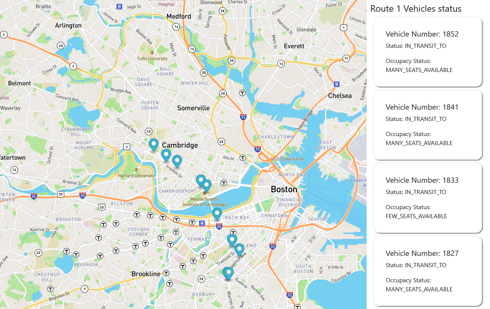

# Real Bus Tracker
A real-time tracker of the routes vehicles in Boston.

## Description
This pase allows you to track the routes vehicles of public transport in Boston. You can check the current location of each of them, and some useful information, like the Occupacy status.
## How to Run
#### Download this repository.
Just clone or download this repository, and open the <code>index.html</code> file on your favorite web browser.
## Roadmap
There are some feature will be introduced in the future.
* To Improve the visual identification of the buses information and the markers in the map.
* To allow select more routes (Currently the info available is only for the route 1).
* To improve the information displayed.

## License information
This code is under MIT licence, you can find the complete file [here](https://github.com/ZiurN/JefersonMITxPRORealTimeBusTracking/blob/main/LICENSE)